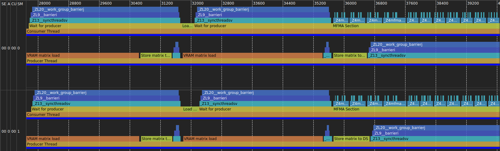
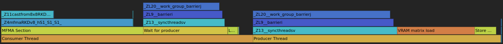
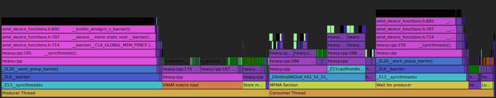

# SQTT Instrumentation for AMDGPU

Insert `s_ttracedata` markers into HIP device code for SQTT/ATT tracing.
Two modes: manual user markers and automatic instrumentation via an LLVM pass plugin.
Zero runtime cost when disabled.

## Prerequisites

- ROCm 7.13 or
- Rocprofiler-sdk built from develop.

## Building the pass plugin

```bash
cmake -B build -DCMAKE_PREFIX_PATH=/opt/rocm
cmake --build build
```

This produces `build/lib/libsqttinstrumentpass.so`.

Use `CMAKE_PREFIX_PATH` to select a specific ROCm installation:

```bash
cmake -B build-rocm713 -DCMAKE_PREFIX_PATH=/opt/rocm-7.13.0
cmake --build build-rocm713
```

## Quick start

### User markers only

Add markers to your HIP code and compile with `-DSQTT_ENABLED=1`:

```cpp
#include "markers.hpp"

__global__ void my_kernel(float *data, int n) {
    int idx = blockIdx.x * blockDim.x + threadIdx.x;
    if (idx >= n) return;

    sqtt_marker_enter("work");
    data[idx] = do_work(data[idx]);
    sqtt_marker_data("work_value", static_cast<uint32_t>(idx));
    sqtt_marker_exit("work");
}
```

```bash
hipcc -DSQTT_ENABLED=1 -fpass-plugin=build/lib/libsqttinstrumentpass.so \
      -I include/rocprof_trace_decoder/cxx/ my_kernel.hip -o my_kernel
```

Without `-DSQTT_ENABLED=1` (or with `-DSQTT_ENABLED=0`), all marker calls
compile to nothing. You can leave them in production code permanently.

`sqtt_marker_data(name, value)` emits a named point marker followed by one raw
32-bit payload record. The funcmap annotates that marker with
`R:ID:extra_payload_count=1` so decoders treat the next shaderdata record as
payload, not as a separate marker header.

### User markers with scope filtering

The pass wraps every `s_ttracedata` call with a scope check so that only
waves on matching CUs/SIMDs/WGs emit markers:

```bash
# Only CU 0, SIMD 0, all workgroups
SQTT_SCOPE_CU=0x1 SQTT_SCOPE_SIMD=0x1 \
hipcc -DSQTT_ENABLED=1 \
      -fpass-plugin=build/lib/libsqttinstrumentpass.so \
      -I include/rocprof_trace_decoder/cxx/ my_kernel.hip -o my_kernel
```

By default the pass limits markers to CU 0-1 (`SQTT_SCOPE_CU=0x3`).

### Automatic function instrumentation

Automatically insert entry/exit markers into device functions that exceed
a size threshold. Kernels (`__global__`) are not instrumented because
SQTT already generates wave start/end markers for them.

```bash
SQTT_INSTRUMENT_FUNCTIONS=10 \
hipcc -DSQTT_ENABLED=1 \
      -fpass-plugin=build/lib/libsqttinstrumentpass.so \
      -I include/rocprof_trace_decoder/cxx/ my_kernel.hip -o my_kernel
```

Use weighted cost instead of instruction count:

```bash
SQTT_INSTRUMENT_FUNCTIONS=cost:50 \
hipcc -DSQTT_ENABLED=1 \
      -fpass-plugin=build/lib/libsqttinstrumentpass.so \
      -I include/rocprof_trace_decoder/cxx/ my_kernel.hip -o my_kernel
```

### Automatic barrier instrumentation

Insert point markers around standalone `s_barrier`, `s_barrier_signal`, and
`s_barrier_wait`:

```bash
SQTT_INSTRUMENT_BARRIERS=1 \
hipcc -DSQTT_ENABLED=1 \
      -fpass-plugin=build/lib/libsqttinstrumentpass.so \
      -I include/rocprof_trace_decoder/cxx/ my_kernel.hip -o my_kernel
```

### Automatic memory operation markers

Insert point markers around groups of global/buffer/flat memory operations
(LDS and private/scratch are excluded):

```bash
SQTT_INSTRUMENT_MEMORY=2:5 \
hipcc -DSQTT_ENABLED=1 \
      -fpass-plugin=build/lib/libsqttinstrumentpass.so \
      -I include/rocprof_trace_decoder/cxx/ my_kernel.hip -o my_kernel
```

Format: `N:M` where N = number of memory ops per marker, M = max instruction
gap between ops in the same sequence. `2:5` means "emit one marker per 2 ops,
sequence breaks if gap > 5 instructions." With N=1, every memory op gets its
own marker. Separate IDs are used for loads (`vmem_load`) and stores
(`vmem_store`). Loads and stores are never mixed in the same group — a
load/store transition always splits the sequence.

### Memory address tracing

Dump per-lane virtual addresses for every memory operation into the trace
stream. Each memory op gets a unique marker ID with source location, enabling
cache line utilization analysis, stride detection, and coalescing analysis:

```bash
SQTT_TRACE_ADDRESSES=memory \
hipcc -DSQTT_ENABLED=1 \
      -fpass-plugin=build/lib/libsqttinstrumentpass.so \
      -I include/rocprof_trace_decoder/cxx/ my_kernel.hip -o my_kernel
```

Trace LDS addresses only:

```bash
SQTT_TRACE_ADDRESSES=lds \
hipcc -DSQTT_ENABLED=1 \
      -fpass-plugin=build/lib/libsqttinstrumentpass.so \
      -I include/rocprof_trace_decoder/cxx/ my_kernel.hip -o my_kernel
```

Trace both global and LDS:

```bash
SQTT_TRACE_ADDRESSES=memory,lds \
hipcc -DSQTT_ENABLED=1 \
      -fpass-plugin=build/lib/libsqttinstrumentpass.so \
      -I include/rocprof_trace_decoder/cxx/ my_kernel.hip -o my_kernel
```

`SQTT_TRACE_ADDRESSES` and `SQTT_INSTRUMENT_MEMORY` are mutually exclusive.
Address tracing emits a header marker for every op, making
`SQTT_INSTRUMENT_MEMORY` redundant.

Analyze address traces after capture:

```bash
rocprofv3 --att -d trace_output -- ./my_app
python3 scripts/sqtt_memory_trace.py trace_output/ -o addresses.json
python3 scripts/sqtt_memory_trace.py trace_output/ --summary
```

The trace protocol emits a header marker, the EXEC mask, and then
per-lane addresses for all lanes. When at least one qualifying operation is
traced, the funcmap records the wave size as `W:64` or `W:32`, and address-trace
header IDs get `R:ID:extra_payload_count=N` metadata for the number of following
payload records. Markers without an `R:` row have an implicit count of zero. The
decoder filters by the EXEC mask to report only active lanes. The parser
demultiplexes interleaved records from concurrent waves by grouping on `(cu,
simd, wave_id)` before parsing each wave's address block.

Any marker with `extra_payload_count > 0`, including address blocks and
`sqtt_marker_data()`, requires `SQTT_SHADER_CLOCK_BITS=0`. Shader-clock
packing is disabled by default; an explicit nonzero setting is an error.

### Everything together

All options compose. User markers, auto-function, auto-barrier, memory ops,
and scope filtering work simultaneously:

```bash
SQTT_INSTRUMENT_FUNCTIONS=cost:50 \
SQTT_INSTRUMENT_BARRIERS=1 \
SQTT_INSTRUMENT_MEMORY=2:5 \
SQTT_SCOPE_CU=0x1 \
SQTT_SCOPE_SIMD=0x1 \
hipcc -DSQTT_ENABLED=1 \
      -fpass-plugin=build/lib/libsqttinstrumentpass.so \
      -I include/rocprof_trace_decoder/cxx/ my_kernel.hip -o my_kernel
```

## Marker API

```cpp
// Named markers (requires pass plugin, auto-assigned IDs, deduplication)
sqtt_marker_enter("my_scope");      // push scope
sqtt_marker_exit("my_scope");       // pop scope
sqtt_marker_point("checkpoint");    // point event (no push/pop)

// Numeric markers (sched_barrier(0) on each side; pass plugin adds the
// SQTT_MEM_BARRIER-controlled boundary on top)
sqtt_marker_enter(uint32_t id);     // push scope
sqtt_marker_exit(uint32_t id);      // pop scope
sqtt_marker_point(uint32_t id);     // point event
```

### Named markers (recommended)

Use string-based markers for readable trace output with automatic ID management:

```cpp
#include "markers.hpp"

__global__ void my_kernel(float *data, int n) {
    int idx = blockIdx.x * blockDim.x + threadIdx.x;
    if (idx >= n) return;

    sqtt_marker_enter("load_phase");
    float val = data[idx];
    sqtt_marker_exit("load_phase");

    sqtt_marker_enter("compute_phase");
    val = val * val + 1.0f;
    sqtt_marker_exit("compute_phase");

    sqtt_marker_point("store_begin");
    data[idx] = val;
}
```

Named markers require the pass plugin (`-fpass-plugin=build/lib/libsqttinstrumentpass.so`).
The pass:

1. Finds all `sqtt_marker_enter("...")`, `sqtt_marker_exit("...")`,
   `sqtt_marker_point("...")`, and `sqtt_marker_data("...", value)` calls
2. Assigns unique IDs (starting at 1) with deduplication within the same
   scope/point/data marker kind
3. Fuses adjacent exit+enter pairs into single `s_ttracedata` instructions
   with `exit_prev=true`, halving the overhead for scope transitions
4. Replaces each call with `s_ttracedata` + scope checks
5. Records `U:ID:name` entries in the `.sqtt_funcmap` section

If you forget to load the pass plugin, you get a linker error
("undefined reference to `__sqtt_named_marker_enter`") -- no silent miscompilation.

When `SQTT_ENABLED=0` (the default), all markers compile to nothing.

### Numeric markers

For cases where you don't need the pass plugin, use numeric IDs directly.
The header shifts the ID into bits [31:2] and sets the appropriate flags.
Exit markers always emit `EXIT_PREV` (value 1) regardless of the ID passed.

## Scope control and environment variables

All variables are read at **compile time**. They configure the pass plugin
or the preprocessor, not runtime behavior.

### Master switch (preprocessor define)

| Variable | Values | Default | Description |
|---|---|---|---|
| `SQTT_ENABLED` | `0`, `1` | `0` | Pass as `-DSQTT_ENABLED=1` to hipcc. When 0, all user marker calls compile to nothing. |

### Scope control plugin options (environment variables)

Set these as env vars before the hipcc command. The pass plugin reads them
directly via `getenv()`.

| Variable | Format | Default | Description |
|---|---|---|---|
| `SQTT_SCOPE_WAVE` | hex bitmask or `-1` | `-1` (all) | Which waves emit markers. Wave 0-31, bits [31:0]. |
| `SQTT_SCOPE_SIMD` | hex bitmask or `-1` | `0xF` (all 4) | Which SIMDs emit markers. 4 SIMDs, bits [3:0]. |
| `SQTT_SCOPE_CU` | hex bitmask or `-1` | `0x3` (CU 0-1) | Which CUs emit markers. Bit N = CU N. |
| `SQTT_SCOPE_WG` | hex bitmask or `-1` | `-1` (all) | Which workgroups emit markers. WG 0-31, bits [31:0]. |
| `SQTT_INSTRUMENT_FUNCTIONS` | `N` or `cost:N` | off | Instrument device functions exceeding threshold. `20` = instruction count > 20. `cost:100` = weighted cost > 100. |
| `SQTT_INSTRUMENT_BARRIERS` | `0`, `1` | `0` | Instrument barriers. Consecutive signal+wait pairs fuse to a single marker. |
| `SQTT_INSTRUMENT_MEMORY` | `N:M` | off | Instrument memory ops. N = ops per marker, M = max gap. `2:5` = 1 marker per 2 ops, sequence breaks at gap > 5. Covers global, buffer, flat (not LDS/scratch). |
| `SQTT_TRACE_ADDRESSES` | `memory`, `lds`, or both | off | Trace per-lane virtual addresses. Mutually exclusive with `SQTT_INSTRUMENT_MEMORY`. `memory` = flat/global (AS=0/1) and buffer, `lds` = LDS (AS=3). Expensive. |
| `SQTT_MEM_BARRIER` | `none` / `asm` / `fence` (or `0` / `1` / `2`) | `fence` | Reordering boundary planted around every marker. `fence` (default) emits `fence syncscope("workgroup") acq_rel` tagged with AMDGPU local/LDS synchronization metadata, anchoring markers against optimizer and scheduler movement without marker-generated global cache invalidation. `asm` plants an empty `~{memory}` inline asm (IR/MIR-only constraint, no machine code). `none` disables both. Default favors marker accuracy; opt down for tight kernels. |
| `SQTT_SHADER_CLOCK_BITS` | unsigned integer | `0` | Number of gfx12 marker header high bits reserved for shader clock. Set a nonzero value to enable packing; it is invalid with any payload-bearing marker. |
| `SQTT_SHADER_CLOCK_SHIFT` | unsigned integer | `4` | Source bit offset in the shader-clock low word for the packed field. |

## Examples

### Shader wave trace as seen with auto instrumentation and user markers together



### Coarse Flamegraph derived from the previous trace without instruction tracing



### Fine Flamegraph derived from the previous trace with instruction tracing



### User markers (`test/markers/kernels/heavy.cpp`)

The kernel in `heavy.cpp` uses named markers to annotate producer/consumer
threads and individual phases (memory loads, LDS stores, MFMA compute). Here is the
consumer thread's inner loop, showing how markers bracket each phase:

```cpp
sqtt_marker_enter("Consumer Thread");

// ...

for (int k1=0; k1 < KDIM; k1 += 2*SHMBLOCK)
{
    // ...
    for (int k2=0; k2 < 2*SHMBLOCK; k2 += SHMBLOCK)
    {
        sqtt_marker_enter("Wait for producer");
        __syncthreads();
        sqtt_marker_exit("Wait for producer");

        sqtt_marker_enter("Load matrix from DS");
        // ... load from shared memory into registers ...
        sqtt_marker_exit("Load matrix from DS");

        sqtt_marker_enter("MFMA Section");
        for (int n=0; n<HEIGHT; n++) for (int r1=0; r1<WIDTH; r1++)
        {
            Vec4 res = mfma(a0_load[r1], a1_load[r1], b0_load[n], b1_load[n]);
            for (int m=0; m<4; m++) reg_res[r1][m*HEIGHT + n] += scal[r1][m] * res[m];
        }
        sqtt_marker_exit("MFMA Section");
    }
}

sqtt_marker_exit("Consumer Thread");
```

Build with the pass plugin and capture a trace:

```bash
hipcc -DSQTT_ENABLED=1 -fpass-plugin=build/lib/libsqttinstrumentpass.so \
      -I include/rocprof_trace_decoder/cxx/ test/markers/kernels/heavy.cpp -o heavy

rocprofv3 --att -d trace -- ./heavy
```

### Automatic function instrumentation

The `auto.cpp` test contains a kernel calling device functions of varying size.
Functions exceeding the threshold are automatically instrumented with entry/exit
markers -- no source changes needed:

```cpp
__device__ float add_one(float x)
{
    asm volatile("v_add_f32 %0, %1, 1" : "=v"(x) : "v"(x));
    // ...
    return x;
}

__device__ float heavy_compute(int iters, float* out)
{
    float result = out[threadIdx.x];
    for (int i = 0; i < iters; i++) {
        result = add_one(result);
        result = result / (result + 1.0f);
        // ...
    }
    return result;
}

__global__ void compute_kernel(float *out, const float *in, int size, int iters) {
    // ...
    float val = heavy_compute(iters, shm);
    out[idx] = add_one(val);
}
```

Build with automatic function instrumentation and capture a trace:

```bash
SQTT_INSTRUMENT_FUNCTIONS=10 \
hipcc -DSQTT_ENABLED=1 -fpass-plugin=build/lib/libsqttinstrumentpass.so \
      -I include/rocprof_trace_decoder/cxx/ test/markers/kernels/auto.cpp -o auto

rocprofv3 --att -d trace -- ./auto
```

## Decoding the function map

Auto-instrumented binaries contain a `.sqtt_funcmap` section mapping IDs to
function names. Extract it from the code object:

```bash
# Extract code object from the binary
llvm-objdump --offloading my_kernel

# Decode the function map (resolves ELF vaddrs)
python3 scripts/sqtt_decode_funcmap.py my_kernel.0.hipv4-amdgcn-amd-amdhsa--gfx942

# With demangled names
python3 scripts/sqtt_decode_funcmap.py my_kernel.0.hipv4-amdgcn-amd-amdhsa--gfx942 --demangle
```

Example output:

```
  Type        ID     Extra               Vaddr  Name
  ----       ---     -----               -----  ----
kernel         -         0  0x0000000000001900  my_kernel(float*, int)
  user         1         0                   -  load_phase
  user         2         0                   -  compute_phase
  func         3         0  0x0000000000001000  do_work(float)
 point         4         0                   -  barrier_signal
 point         5         0                   -  barrier_wait
 point         6         0                   -  barrier
```

With address tracing, the funcmap also contains per-op entries with source
locations and a wave size entry:

```
  wave_size: 64
 point         1       130                   -  addr_trace_load@my_kernel.hip:10
 point         2       130                   -  addr_trace_store@my_kernel.hip:12
```

### Weighted cost model

When using `SQTT_INSTRUMENT_FUNCTIONS=cost:N`, instructions are weighted:

| Weight | Instructions |
|---|---|
| 0 | phi, alloca, debug intrinsics, lifetime markers, unreachable |
| 1 | Arithmetic, comparisons, branches, conversions |
| 4 | LDS loads/stores, `ds_*` intrinsics |
| 10 | Global/flat memory loads and stores |
| 16 | `mfma_*` / `wmma_*` matrix operations |

## ID encoding

Marker values are packed into 2 flag bits so that small IDs can use the faster
`s_ttracedata_imm` instruction (8-bit immediate, gfx10+) when shader-clock
packing is inactive. Larger IDs fall back to `s_ttracedata` (32-bit m0, all
targets).

For full M0-based traces, the pass explicitly emits `s_mov_b32 m0`, `s_nop 0`,
then `s_ttracedata` on every target. Address EXEC tracing uses the same
sequence.

```
Both instructions share the same bit layout:

  Bit  0:      exit previous scope (pop top)
  Bit  1:      enter scope (push)
  Bits [7:2]:  6-bit ID   (s_ttracedata_imm, IDs 0-63)
  Bits [31:2]: 30-bit ID  (s_ttracedata, IDs 0-1G)

Decoding (works for both):
  exit_prev = val & 1
  is_enter  = (val >> 1) & 1
  id        = val >> 2
```

The pass plugin automatically selects `s_ttracedata_imm` when the encoded value
fits in 8 bits, the target supports it, and shader-clock packing is inactive.
IDs 1-63 use the fast path on RDNA. Exit markers use the same selection rule.

On gfx1200, gfx1201, and gfx1250, a nonzero `SQTT_SHADER_CLOCK_BITS` enables
clock packing. With the usual 12-bit setting, it occupies marker bits 31-20
and leaves 18 marker ID bits plus the two low flags. gfx1250 uses
`s_get_shader_cycles_u64`; gfx1200 and gfx1201 use
`s_getreg_b32 hwreg(HW_REG_SHADER_CYCLES_LO, 4, 12)`. Configure this with
`SQTT_SHADER_CLOCK_BITS` and `SQTT_SHADER_CLOCK_SHIFT`; it defaults to `0`,
which uses the no-clock full-ID layout. The funcmap emits
`M:shader_clock_bits=N;shader_clock_shift=S` whenever clock packing is active.
Clock packing cannot be combined with any marker that has an `R:` payload row.
Numeric point and enter markers keep their legacy values; bare exits use the
packed form because their value is indistinguishable from a generated exit.

The packed clock is a truncated sample at instruction issue. Shaderdata and
shader clocks have an unknown fixed phase per physical SIMD, so `att_tool.py`
cancels it by comparing clock/time deltas to an arbitrary header in the same
SIMD/layout. It takes the minimum from the complete domain and applies the
relative correction retroactively. Apply this only to headers, never `R:`
payloads. `Funcmap::marker_encoding` exposes
`marker_id_mask()`, `packed_shader_clock_mask()`, and
`shader_clock_source_mask()`; without `M:` metadata those describe the legacy
full-width ID layout.

`att_tool.py` applies that correction by default and masks each recognized
header to its ordinary legacy-form marker value for existing viewers. Use
`--no-decode-markers` to preserve packed values and arrival timestamps.
For externally packed payload blocks it may normalize a recognized header,
but does not apply timestamp correction.

For packed code objects, `att_tool.py` adds six-column `sqtt_funcmap` rows and
packed-layout/payload tables to `code.json`. Readers that do not know them
continue using the original JSON; legacy `code.json` output is unchanged.

The marker type (function, user, barrier, memory) is determined by looking up
the ID in the `.sqtt_funcmap` section, not from encoding bits.

**Semantics:**

| enter | exit_prev | id     | meaning                                    |
|-------|-----------|--------|--------------------------------------------|
| 0     | 1         | 0      | exit (pop top scope)                       |
| 0     | 0         | 0      | no-op (reserved)                           |
| 0     | 0         | any    | point marker (no scope change)             |
| 1     | 0         | any    | enter scope (push)                         |
| 1     | 1         | any    | exit previous + enter this ID (transition) |

**IDs** are allocated dynamically from a unified pool. No reserved ranges.
When early function instrumentation runs, its function and already-resolved
named-marker IDs are compacted together by emission count (ties by original
ID). System IDs follow, while late-resolved named markers and address IDs
receive the next available IDs as they are encountered:

```
  1-N         early functions and named markers, compacted together
  N+1..       barrier and vmem IDs (when enabled)
  ...         late-resolved named and addr_trace_* IDs as encountered
```

When address tracing is enabled, each memory operation gets its own unique
marker ID. The funcmap records `P:ID:addr_trace_load@file.hip:42` with
source location for correlation.

## Verifying instrumentation

Check that markers appear in the IR:

```bash
SQTT_INSTRUMENT_FUNCTIONS=5 \
hipcc -DSQTT_ENABLED=1 \
      -fpass-plugin=build/lib/libsqttinstrumentpass.so \
      -I include/rocprof_trace_decoder/cxx/ -S -emit-llvm my_kernel.hip -o - \
      | grep ttracedata
```

Check that disabled builds have no markers:

```bash
hipcc -I include/rocprof_trace_decoder/cxx/ -S -emit-llvm my_kernel.hip -o - | grep ttracedata
# (should produce no output)
```
