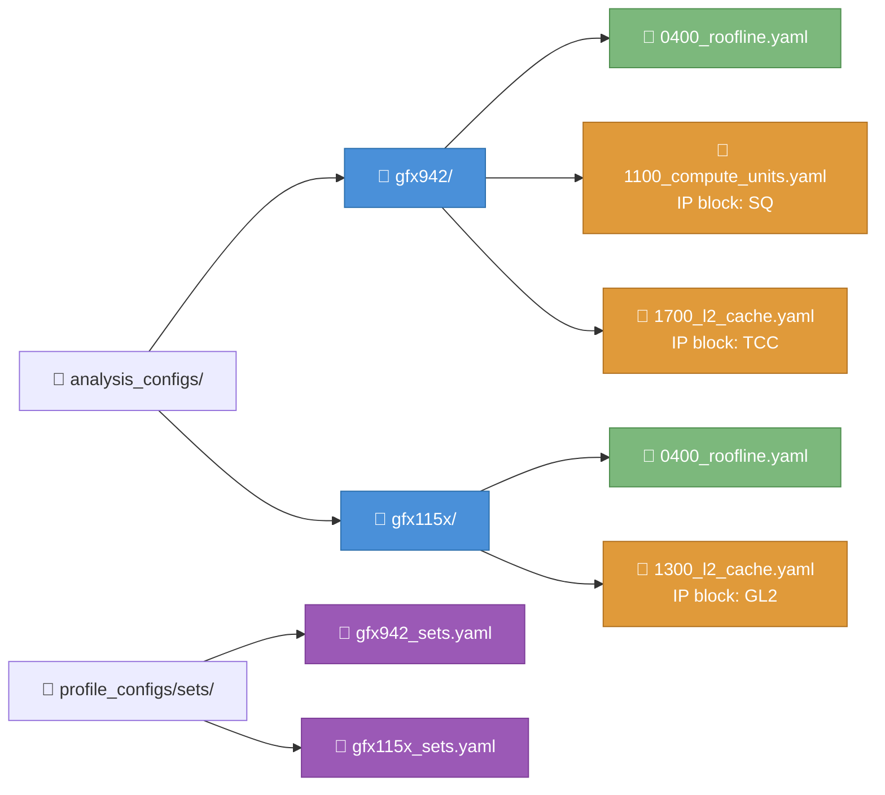
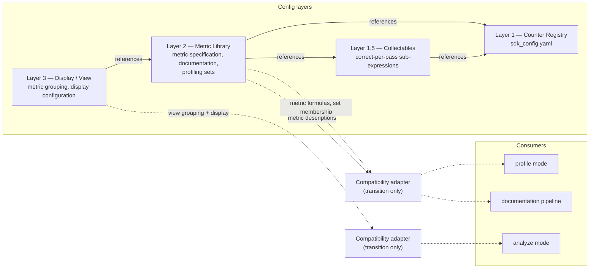
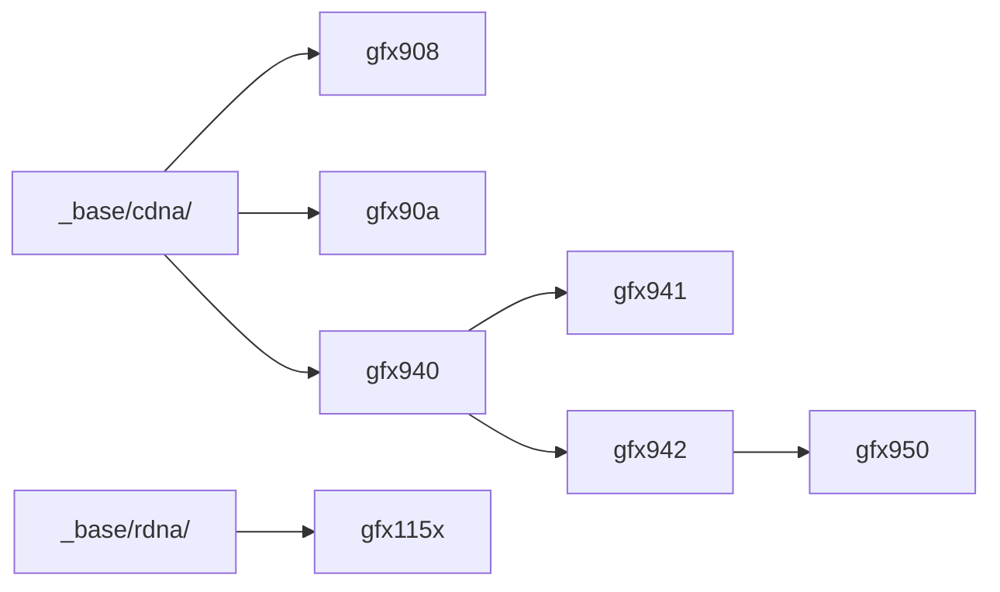
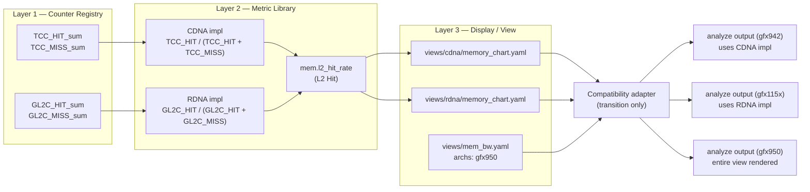
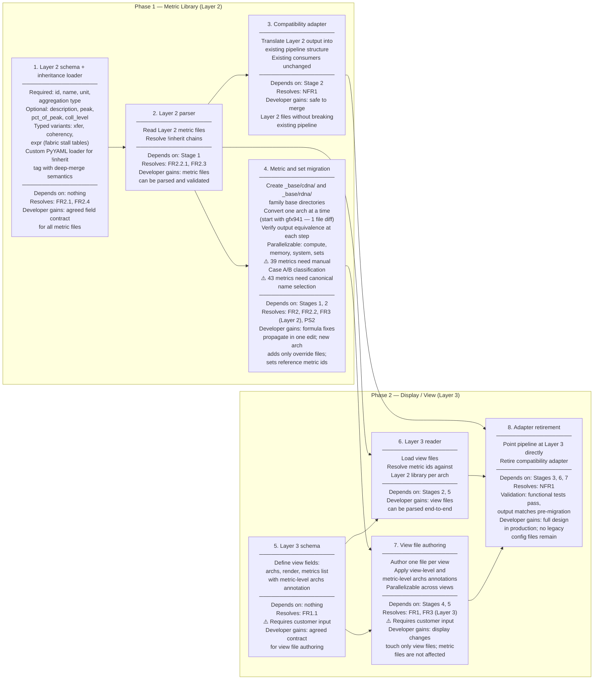

# Analysis config YAML redesign

## System context

### What analysis config YAMLs are

rocprof-compute stores and tracks the supported metrics in YAML format as "analysis config YAML files" (analysis configs). They are consumed by three parts of the tool and are referenced by the ROCm official documentation.

> **Scope:** This document covers the analysis config file structure only. Improvements to the metric equation itself are a separate design.

**What analysis configs do:**

- Supply metric formulas to **profile mode** (the formulas contain the counters to collect)
- Supply metric formulas and display configuration to **analyze mode** (determines what to output and how)
- Supply metric descriptions to the **documentation pipeline** (consumed as a Sphinx-generated reference)

**What analysis configs do not do:**

- They do not define raw PMC counters — those live in `sdk_config.yaml`, which is maintained separately and has no direct interaction with the analysis configs
- They do not control the profiling output format (`pmc_perf_*.yaml`)
- They do not interface with rocprofiler-sdk

### Terminology

| Term | Definition |
|---|---|
| Panel / Block | A single analysis config. Each analysis config displays one panel or one block of the `analyze` mode output. |
| Table | A grouping of metrics within an analysis config. |
| Family | An architecture family consists of architectures of similar design methodology. Currently, rocprof-compute supports 2 families: CDNA and RDNA. |
| Set | A set of metric formulas whose counters fit in a single hardware pass. |

### Structure

The analysis configs use a 2-level grouping structure:

- **Top level:** organized by hardware architecture (e.g., gfx942, gfx950)
- **Within each architecture:** organized by either IP block (e.g., TCP) or use case (e.g., roofline)

Within each analysis config, metrics are further grouped into sub-categories.

Currently, rocprof-compute supports 7 architectures from 2 families across a total of 21 analysis config YAML files.


> 🟦 Architecture &nbsp;&nbsp; 🟩 Use case grouping &nbsp;&nbsp; 🟧 IP block grouping &nbsp;&nbsp; 🟪 Profiling sets

### What the analysis config currently contains

Each analysis config YAML file contains four types of information:

1. **Metric specification:** the formula, unit, peak, and aggregation fields for each metric
2. **Metric grouping:** which panel and table a metric belongs to, and in what order
3. **Display configuration:** column headers, rendering style, and UI layout for the `analyze` output
4. **Documentation:** human-readable metric descriptions used by the Sphinx-generated metric reference

```yaml
# Example: gfx942/1100_compute_units_compute_pipeline.yaml
Panel Config:
  id: 1100                              # metric grouping
  title: "Compute Units - Compute Pipeline"    # display config
  data source:
    - metric_table:
        id: 1101
        title: "Compute Speed-of-Light"
        header:                         # display config
          metric: "Metric"
          avg: "Avg"
        metric:
          VALU Utilization:
            avg: "SUM(SQ_INSTS_VALU) / SUM($denom)"   # metric specification
            unit: "Percent"                             # metric specification
            peak: "($max_sclk * $cu_per_gpu * 4096) / 1000"  # metric specification
  metrics_description:
    VALU Utilization: >-                # documentation
      The percentage of time the VALU was busy...
```


## Problem statement

### [PS1] No clear requirements constrain what analysis configs should provide

Without defined requirements, new additions increase maintenance cost, and manual modifications introduce further divergence. The design cannot be evaluated against criteria that don't exist.

The two known users — tool developers and tool users — have different needs:

- **Developers** need easy maintenance for metric modifications and architecture additions, and a design that integrates well with the source code.
- **Users** need to profile metrics relevant to their workload, view results in a structured way, and understand what the tool is showing them.

### [PS2] Per-architecture duplication makes metric maintenance costly and error-prone

This problem is specific to tool developers — see [Design note: developer-focused redesign](#design).

- Every metric change carries the risk of incomplete propagation.
- PR review burden scales linearly with the number of architectures.
- Platform enabling for a new arch requires duplicating 18+ files and manually patching differences.

As an example, the most recent architecture addition (gfx950) required adding 19 new YAML files. A single metric formula fix that applies across CDNA3 variants (gfx940, gfx941, gfx942) requires 3 identical edits and 3 review cycles.

Because analysis configs are organized per architecture, every metric that applies to multiple architectures is fully copied. Static analysis across all files shows:

- **69.1% of metric definitions are duplicates** (1,862 / 2,693)
- **46.4% of descriptions are duplicates** (1,135 / 2,448)

There is no inheritance or override mechanism. Fixing a formula in gfx940 does not fix it in gfx941, gfx942, or gfx950.

```
  "VALU Utilization" defined 7 times (3 shown):

  gfx908/  ──►  VALU Utilization { formula, unit, description, peak }
  gfx941/  ──►  VALU Utilization { ... unit="GFLOPs" }  (unit drifted)
  gfx115x/ ──►  VALU Utilization { ... }  (different formula — different arch family)
```

### [PS3] Analysis config files mix unrelated concerns, making changes harder and riskier than they need to be

This problem is specific to tool developers — see [Design note: developer-focused redesign](#design).

All four types of information listed in System Context (metric specification, metric grouping, display configuration, documentation) are in the same file with no boundary between them.

- A change to how a metric is displayed requires opening the same file as a change to how it is calculated.
- A change to any single concern carries risk of unintended impact on other concerns in the same location.

For example, the current `VALU FLOPs` unit string has drifted between gfx940 (`"GFLOP/s"`) and gfx941 (`"GFLOPs"`) — the same metric with the same formula reports different units. This drift was not caught because the change was bundled with unrelated modifications in the same file.

```yaml
# gfx940
VALU FLOPs:
  unit: "GFLOP/s"

# gfx941
VALU FLOPs:
  unit: "GFLOPs"    # same metric, same formula, different unit string
```


## Requirements

> **Assumption:** There are no pre-existing defined requirements the design must follow.
>
> **Constraints:** The design should not break existing working conditions unless specified.

### Functional requirements

#### [FR1] — Metric grouping must reflect explicit, user-driven intention to both users and developers
- Example: "roofline" has a clear, self-evident purpose.
- **[FR1.1]** The grouping assignment of a metric must be explicitly declared, not inferred from file location or naming.
- **[Measured by]** Given the possible groupings and a metric, a new engineer can predict which grouping the metric belongs to.

#### [FR2] — A metric and its full specification should be defined exactly once
- Any other appearance of that metric should be a reference to the single definition, not a copy.
- **[FR2.1]** The attributes that make up a complete metric definition must be explicitly declared. Based on static analysis of the current 122 YAML files (see [`metric-analysis-2026-07-13.md`](metric-analysis-2026-07-13.md)), the required and optional fields are:
    - **Required:** `id`, `name`, `unit`, aggregation type (`avg/min/max` or `value`), `archs` or `implementations`
    - **Optional:** `description`, `peak`, `pct_of_peak`, `coll_level`
    - **Typed variants** (not general metric fields): `xfer`, `coherency`, `expr`, `type`, `transaction` — these appear in specific table types only and require a separate schema treatment
- **[FR2.2]** Metrics must be uniquely identifiable by a stable, explicitly declared id, not by position in a file or directory. A positional reference (e.g., the 3rd metric in file `1100_*.yaml`) breaks whenever metrics are reordered or files are renamed. An explicit `id` field survives both.
    - **[FR2.2.1]** Public names (user-facing) are not to be used as internal indexing. Internal indices and front-end names must be decoupled. A developer renaming the display name of a metric should not require updating any code or any file other than the metric's own definition. *(Note: 95 of 824 metric names contain special characters such as `()`, `/`, `%`, or `:` — ids cannot be mechanically derived from names and must be explicitly declared.)*
- **[FR2.3]** A metric's architecture availability must be declared within its single definition to avoid redundancy.
- **[FR2.4]** Metrics with table-type-specific fields (e.g., fabric stall breakdown metrics with `xfer`, `coherency`, `expr` fields) must be handled as typed variants. The general metric definition schema does not need to accommodate these fields.
- **[Measured by]** The number of full metric definitions for any given metric is exactly 1. With YAML inheritance, the family base file is the single definition; per-arch override files are not redefinitions — they modify specific fields while inheriting the rest.
- **[Assumption]** Description alone is not a reliable equality criterion — ambiguous cases require manual classification. See [OQ3](#oq3--39-metrics-with-both-description-and-formula-drift-require-manual-classification) and [OQ4](#oq4--43-same-description-different-name-cases-require-canonical-name-selection).

#### [FR3] — Each concern type should be separated at the file level
- Example: the definition of a metric, the definition of a metric grouping, and the display details of a metric grouping (analyze mode output) should not be in one file.
- **[FR3.1]** The boundary between concerns must be a file boundary, not a section within a shared file. A diff that touches only one file unambiguously touches only one concern.
- **[Measured by]** A change scoped to concern type X produces a diff that touches only locations of type X.
- **[Assumption]** The analysis config does not need to be readable and self-contained for users — see [Design note: developer-focused redesign](#design).

### Non-functional requirements

#### [NFR1] — The redesigned config structure should be adoptable incrementally
It should be possible to migrate one concern at a time without requiring a coordinated change across all concerns simultaneously.


## Design

> **Assumptions**
> - This redesign prioritizes the developer experience. The problems identified in [[PS2]](#ps2-per-architecture-duplication-makes-metric-maintenance-costly-and-error-prone) (duplication) and [[PS3]](#ps3-analysis-config-files-mix-unrelated-concerns-making-changes-harder-and-riskier-than-they-need-to-be) (mixed concerns) are specific to developers. There is no sufficient evidence that users regularly interact with the analysis config files. The analysis configs therefore do not need to be readable or self-contained for users. Design trade-offs in this document are resolved in favor of developers.
> - Baseline comparison is out of scope. However, replacing positional identifiers with stable metric ids makes baseline comparison across architectures and runs structurally easier.
>
> **Constraints**
> - Existing `profile` and `analyze` mode behavior (CLI, WebUI, roofline) must be preserved during transition — same results, different config source.

### Proposed design

> **Note:** The specific schemas, file layouts, and examples in this section are illustrative — the exact implementation is not set in stone. The main goal of this design is the separation of concerns into distinct layers.

The current analysis config mixes four types of information in one file (see [What the analysis config currently contains](#what-the-analysis-config-currently-contains)). [[PS3]](#ps3-analysis-config-files-mix-unrelated-concerns-making-changes-harder-and-riskier-than-they-need-to-be) shows that mixing concerns in one file makes every change riskier than it needs to be — a display change and a formula change produce diffs in the same file, making review ambiguous and coupling two unrelated concerns to the same validation rules.

The proposed design separates these into distinct layers. Each layer owns one concern type and may only reference the layer(s) below it. Upward references are not permitted. Separating by file boundary is the simplest mechanism that makes the [[FR3]](#fr3--each-concern-type-should-be-separated-at-the-file-level) measurement ("a change to concern X touches only locations of type X") pass.

During transition, a compatibility adapter translates Layer 2 and Layer 3 output into the structure currently expected by the analysis pipeline — existing consumers require no changes. This satisfies [[NFR1]](#nfr1--the-redesigned-config-structure-should-be-adoptable-incrementally) and allows migrating one layer at a time.


> **Solid arrows** = layer references (each layer may only reference layers below it). **Dashed arrows** = consumed via the compatibility adapter during transition.

### Layer details

| Layer | Owns | References | Design | Alternative | Why |
|---|---|---|---|---|---|
| **Layer 1** Counter Registry | Raw PMC counter definitions per architecture (`sdk_config.yaml`) | Nothing (ground truth) | Already exists as the SDK config. No structural change needed. | — | — |
| **Layer 1.5** Collectables | Sub-expressions of metrics whose counters fit in a single hardware pass | Layer 1 counter names | - Each collectable is a formula fragment that produces a correct result within one hardware pass<br>- Metrics whose full formula exceeds the pass limit are composed of collectables<br>- ⚠️ Target: integrate into `sdk_config.yaml` as part of the SDK counter definitions. Requires collaboration with the SDK team. Until then, defined separately by rocprof-compute. | — | — |
| **Layer 2** Metric Library | Metric specification, documentation, profiling sets | Layer 1 counter names, Layer 1.5 collectables | - One file per hardware concept (e.g., SQ, TCP, TCC), multiple metrics per file<br>- Profiling sets are a hardware concept within Layer 2: one file per set, referencing metrics by id, constrained by hardware pass limits. Both developers and users may author sets.<br>- Per-architecture files are preserved, organized as family base + arch overrides using YAML inheritance (`!inherit` tag) — see [YAML inheritance](#yaml-inheritance)<br>- Two family bases (`_base/cdna/`, `_base/rdna/`); inheritance chains mirror hardware lineage (e.g., `cdna → gfx940 → gfx942 → gfx950`)<br>- Each metric has a canonical `name` — the stable, unambiguous display name for the metric concept<br>- Built-in sets may optionally have a matching Layer 3 view for structured display; user-defined sets get default flat rendering<br>- ⚠️ Default display behavior is unresolved — see [OQ2](#oq2--default-display-for-set-based-profiling) | One file for all metrics, similar to SDK counter yaml. | [[FR2]](#fr2) requires a metric is defined exactly once. Single-place definition eliminates the per-architecture duplication identified in [[PS2]](#ps2-per-architecture-duplication-makes-metric-maintenance-costly-and-error-prone), satisfying FR2.2. |
| **Layer 3** Display / View | Metric grouping, display configuration | Layer 2 metric ids | - One file per view (what the user sees as a panel or block)<br>- Each view references metrics by id and declares which to show, in what order, and how to render<br>- A view may declare an optional `label` override for a metric — the same metric concept intentionally appears under different names in different panel contexts (e.g., `"L2 Cache Hit Rate"` in a speed-of-light panel vs. `"Hit Rate"` in a memory chart). Static analysis found 234 such cases within a single architecture. If no `label` is declared, the canonical `name` from Layer 2 is used.<br>- **View-level `archs:`** — entire view is arch-conditional<br>- **Metric-level `archs:`** — individual entries skipped for unsupported archs<br>- ⚠️ What views exist and what they contain requires customer input — see [OQ1](#oq1--layer-3-view-definition-requires-customer-input)<br>- ⚠️ Default display for set-based analysis is unresolved — see [OQ2](#oq2--default-display-for-set-based-profiling) | Drive grouping and display directly in code — no view YAML layer. | [[FR1]](#fr1) (FR1.1) requires grouping to be explicitly declared, not inferred. Hardcoding panel structure in code makes grouping implicit and non-auditable by non-developers, and every display change requires a code change and a release. |

### YAML inheritance

Layer 2 metric files use a custom `!inherit` YAML tag to eliminate per-architecture duplication while keeping files separate. This is not a native YAML feature — it requires a custom PyYAML loader.

A file beginning with `!inherit <path>` loads the referenced base file first, then deep-merges the current file's content on top.

**Merge rules:**

| Input | Behavior |
|---|---|
| Map + map | Recursive deep merge. Override keys win; base-only keys preserved. |
| `data source` list | Matched by `metric_table.id` (not position), then deep-merged per entry. New entries appended. |
| Scalar | Override replaces base. |
| New key in override | Appended to the map. |

**Inheritance hierarchy:**



Two separate family bases — CDNA and RDNA share no content. Within CDNA, the chain mirrors hardware lineage. Files identical to the base do not exist in the arch directory; they are inherited implicitly. Files that exist contain only `!inherit` plus overrides.

**Example:** gfx941 differs from gfx940 in exactly one file. With inheritance, that file becomes:

```yaml
!inherit ../gfx940/0200_system_speed_of_light.yaml

Panel Config:
  data source:
  - metric_table:
      id: 201
      metric:
        MFMA FLOPs (F8):
          unit: GFLOPs
```

This 7-line file replaces a 300+ line duplicate. The deep merge replaces only the `unit` field within `MFMA FLOPs (F8)`, preserving all other content from gfx940.

### How the layers connect

The diagram below shows how `mem.l2_hit_rate` flows from counters through the metric library into two family-specific views, with the formula resolved at analysis time based on the profiled architecture.



### End-to-end example

The following traces two real metrics from roofline and memory chart through the layered design.
**Metric 1: HBM Bandwidth** (roofline view)
**Metric 2: L2 Hit** (memory chart view)

#### Layer 1 — Counter Registry

Both metrics draw from the same set of L2 counters. These are defined once:

```
TCC_EA0_RDREQ_sum, TCC_EA0_RDREQ_32B_sum, TCC_BUBBLE_sum,
TCC_EA0_WRREQ_sum, TCC_EA0_WRREQ_64B_sum,
TCC_HIT_sum, TCC_MISS_sum
```

Neither metric owns these counters. The counter registry owns them; both metrics reference them.

#### Layer 2 — Metric Library

Each metric is defined once in a family base file. Per-arch files inherit from the base and override only what differs (see [YAML inheritance](#yaml-inheritance)).

Three fields govern metric identity and display:
- **`id`** (`mem.l2_hit_rate`) — the stable internal key used by code and view files to reference a metric. Never shown to users. Never changes.
- **`name`** (`"L2 Hit"`) — the canonical display name. What the user sees in the `analyze` output by default. Lives in Layer 2 alongside the formula. Free to change without updating any view file or code.
- **`label`** — an optional field declared in a Layer 3 view file that overrides `name` for that specific panel. The same metric may intentionally appear under different names in different panels — e.g., `"L2 Hit"` in the memory chart vs. `"L2 Cache Hit Rate"` in the speed-of-light panel. `label` is a display decision made by the view, not the metric. If absent, `name` is used.

```yaml
# _base/cdna/1700_l2_cache.yaml — CDNA family base (shared by gfx908–gfx950)
- id: mem.l2_hit_rate
  name: L2 Hit
  unit: Percent
  formula: ROUND(100 * SUM(TCC_HIT_sum) / SUM(TCC_HIT_sum + TCC_MISS_sum), 0)
  description: >-
    The ratio of cache line requests that hit in the last-level on-chip cache
    over the total number of incoming requests.

- id: mem.hbm_read
  name: HBM Rd
  unit: Requests/normUnit
  formula: ROUND(SUM(TCC_EA0_RDREQ_DRAM_sum) / SUM($denom), 0)
  description: >-
    The total number of L2 requests to read data from the accelerator's local HBM.
```

```yaml
# gfx908/1700_l2_cache.yaml — overrides cache line size (64B instead of 128B)
!inherit ../_base/cdna/1700_l2_cache.yaml

# only the fields that differ from the CDNA base are present
```

```yaml
# _base/rdna/1300_l2_cache.yaml — RDNA family base (separate file, different counters)
- id: mem.l2_hit_rate
  name: L2 Hit
  unit: Percent
  formula: ROUND(100 * SUM(GL2C_HIT_sum) / SUM(GL2C_HIT_sum + GL2C_MISS_sum), 0)
  description: >-
    The ratio of cache line requests that hit in the last-level on-chip cache
    over the total number of incoming requests.

- id: mem.dram_read
  name: DRAM Rd
  unit: Requests/normUnit
  formula: ROUND(SUM(GL2C_MC_RDREQ_sum) / SUM($denom), 0)
  description: >-
    The total number of L2 requests to read data from DRAM.
```

`mem.l2_hit_rate` has the same id and description in both family bases — it is the same metric concept with different formulas per family. `mem.hbm_read` (CDNA) and `mem.dram_read` (RDNA) are different metrics describing different memory subsystems.

#### Layer 3 — Display / View

Each view declares which metrics to show and how to render them. The metric definition is not repeated — only its id is referenced. No metric definition in Layer 2 knows which view will reference it, or how it will be rendered.

```yaml
# views/roofline.yaml  — loads for all architectures
view: Roofline
render: roofline_chart
metrics:
  - mem.hbm_bandwidth                        # available on all archs in scope
  - mem.l2_cache_bandwidth
  - compute.mfma_flops_f8    archs: [gfx940, gfx941, gfx942, gfx950]  # metric-level: not on gfx908/gfx90a
  - compute.mfma_flops_f6f4  archs: [gfx950]                           # metric-level: gfx950 only
  - ...

# views/cdna/memory_chart.yaml  — loads for CDNA only
view: Memory Chart
render: mem_chart
metrics:
  - id: mem.l2_hit_rate                  # Case A: same id, formula resolved at runtime per arch
    label: "L2 Cache Hit Rate"           # label overrides canonical name "L2 Hit" for this panel
  - id: mem.hbm_read                     # Case B: CDNA-specific metric
  - ...

# views/rdna/memory_chart.yaml  — loads for RDNA only
view: Memory Chart
render: mem_chart
metrics:
  - mem.l2_hit_rate         # Case A: same id, different formula selected at runtime
  - mem.dram_read           # Case B: RDNA-specific metric
  - ...

# views/mem_bw.yaml  — view-level: entire view is gfx950-only
view: Memory Bandwidth Analysis
archs: [gfx950]
render: mem_bw_chart
metrics:
  - mem.hbm_rd_bw
  - mem.hbm_wr_bw
  - ...
```

#### What changes when something needs to be updated

Each change touches only the layer that owns the concern — satisfying the [[FR3]](#fr3) measurement criterion.

| Change | Files touched | Files not touched |
|---|---|---|
| Fix HBM Bandwidth formula | `metrics/memory/hbm_bandwidth.yaml` | `views/roofline.yaml`, `views/cdna/memory_chart.yaml`, `metrics/memory/l2_cache.yaml` |
| Rename "HBM Bandwidth" to "HBM BW" | `metrics/memory/hbm_bandwidth.yaml` (`name` field only) | `views/roofline.yaml`, `views/cdna/memory_chart.yaml` (reference `id`, not `name`) |
| Show "HBM BW" in roofline but "HBM Bandwidth" in memory chart | `views/roofline.yaml` (`label: "HBM BW"` on `mem.hbm_bandwidth`) | `metrics/memory/hbm_bandwidth.yaml`, `views/cdna/memory_chart.yaml` |
| Change how roofline is rendered | `views/roofline.yaml` | `metrics/memory/hbm_bandwidth.yaml`, `metrics/memory/l2_cache.yaml` |
| Fix L2 Hit formula for CDNA (Case A) | `metrics/memory/l2_cache.yaml` (CDNA implementation block only) | `views/cdna/memory_chart.yaml`, `views/rdna/memory_chart.yaml` |
| Add a new RDNA-only metric (Case B) | `metrics/memory/l2_cache.yaml` (new entry), `views/rdna/memory_chart.yaml` | `views/cdna/memory_chart.yaml`, `metrics/memory/hbm_bandwidth.yaml` |
| Add a gfx950-only metric to roofline | `metrics/memory/hbm_bandwidth.yaml` (new entry), `views/roofline.yaml` (new id + `archs: [gfx950]`) | `views/cdna/memory_chart.yaml`, `views/rdna/memory_chart.yaml` |
| Add a new gfx950-only view | new `metrics/memory/mem_bw.yaml`, new `views/mem_bw.yaml` with `archs: [gfx950]` | `views/roofline.yaml`, `views/cdna/memory_chart.yaml`, `views/rdna/memory_chart.yaml` |


## Implementation phases




## Validation, security and debuggability

> To be defined after design is established.


## Open questions

*Ordered by impact on implementation — higher priority items block earlier stages.*

### OQ1 — Layer 3 view definition requires customer input
*(blocks Stages 5 and 7)*

What views exist, what metrics each view contains, and how views are organized are decisions that reflect how tool users think about GPU performance analysis. These cannot be determined by developers alone. The current analysis config structure (roofline, memory chart, IP block panels) is a starting point, but must be validated against actual user workflows before the Layer 3 schema is finalized.

### OQ2 — Default display for set-based profiling
*(no longer blocks layer placement — sets are part of Layer 2)*

Sets are part of Layer 2 as a hardware concept alongside IP block metrics. Both developers and users may author sets. The remaining question is default display behavior: when a user profiles with `--set compute_thruput_util`, the tool provides a default flat rendering (table of all metrics in the set) when no matching Layer 3 view exists. Built-in sets may optionally have a matching Layer 3 view for structured display (grouped tables, charts). The default rendering behavior and its interaction with `--set` need to be specified.

### OQ3 — 39 metrics with both description and formula drift require manual classification
*(blocks Stage 4 for affected metrics)*

These cannot be automatically determined to be Case A (same metric, multiple implementations) or Case B (separate metrics). Each must be reviewed by a domain expert before it can be assigned an `id` and migrated to Layer 2. Full list in [`metric-analysis-2026-07-13.md`](metric-analysis-2026-07-13.md).

### OQ4 — 43 "same description, different name" cases require canonical name selection
*(blocks Stage 4 for affected metrics)*

Examples: `['Cache Hit', 'Hit Rate', 'L2 Cache Hit Rate', 'L2 Hit']` all share the same description. A canonical `name` and `id` must be chosen for each group before migration. Full list in [`metric-analysis-2026-07-13.md`](metric-analysis-2026-07-13.md).

### OQ5 — `--filter-blocks` numeric index deprecation timeline
*(no implementation blocked)*

The `--filter-blocks` flag itself is retained — input remains strings. The question is when the numeric positional index scheme (e.g., `11.2.3`) is deprecated in favour of stable metric ids (e.g., `mem.l2_hit_rate`). No deprecation timeline or user migration path has been defined. This can be deferred until after the migration is complete.
