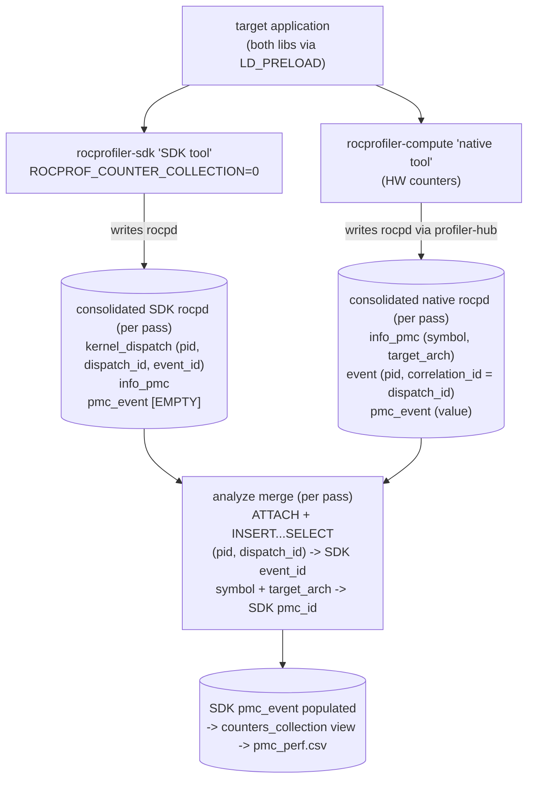

# Write rocpd from the native tool via profiler-hub

## Motivation

During a profiling run rocprofiler-compute produces data from two in-process libraries,
both loaded via `LD_PRELOAD` into the target application
(`src/rocprof_compute_profile/profiler_rocprofiler_sdk.py`):

1. The rocprofiler-sdk "SDK tool", run with `ROCPROF_OUTPUT_FORMAT=rocpd`, writes a rocpd
   SQLite database (kernel dispatches, agents, kernel symbols, an `rocpd_info_pmc` table,
   and an empty `rocpd_pmc_event` table). It is told NOT to collect counters
   (`ROCPROF_COUNTER_COLLECTION=0`).
2. The rocprofiler-compute "native tool" (`src/lib/rocprofiler_compute_tool`) collects the
   hardware counters and currently writes a CSV (`<pid>_native_counter_collection.csv`),
   which the Python layer parses and injects row by row into the SDK rocpd's
   `rocpd_pmc_event` table (`src/utils/rocpd_data.py`, `src/utils/utils_profile.py`).

This replaces the CSV round-trip: the native tool writes its own rocpd directly via
profiler-hub, and the merge into the SDK rocpd moves to analyze mode as a single set-based
SQL statement instead of bespoke CSV parsing in profile mode. Each tool keeps its own
rocpd; they are never co-mingled into one schema.

This builds on separate, in-flight work that consolidates each tool's per-PID rocpds into a
single rocpd per tool; that work must land first. This design takes the two consolidated
rocpds (one per tool, per application-replay pass) as input and does not change how they
are produced.

Scope is counters only. ISA / code-object collection stays as the existing JSON output:
it backs PC sampling, which rocpd has no schema or profiler-hub writer support for yet, so
there is nowhere for that data to land.

## Data flow



## profiler-hub intro

[profiler-hub](https://github.com/ROCm/rocm-systems/tree/develop/profilers/profiler-hub)
is a standalone library for writing rocpd (SQLite) databases. Its public API
is `storage_t` plus `writer_t` (register/insert calls for the rocpd tables).

Key behavior: `writer_t` mints a fresh `rocpd_event` per insert, so a pmc event and a
dispatch cannot share an `event_id` through the API; dispatch linkage is carried on
`event_data_t.correlation_id`, not a shared PK.

Nothing consumes profiler-hub yet and it is not part of the TheRock build;
rocprofiler-compute will be its first consumer.

## Native tool C++ changes

Add `RocpdCountersWriter : public CountersWriter` (the existing abstraction in
`counters_writer.h`) as the default `g_counters_writer`, demoting the CSV writer, which
stays for tests. The native tool always writes a `_native_counter_collection.db` rocpd (no
env-var gating).

`write_counters` opens `storage_t` + `writer_t`, registers the FK-target info rows once
(node, process, agent per distinct `agent_id`, pmc per distinct counter into
`rocpd_info_pmc`), then per counter record calls `insert_pmc_event_data` with
`correlation_id = dispatch_id`. It writes ONLY the counter tables; kernel_dispatch,
kernel_symbol, and code_object come from the SDK rocpd at merge time.

Agent and counter metadata must be captured in the callbacks, which today keep only the
agent handle and counter name. `register_agent_info` / `register_pmc_info` need more (agent
type/name/node, counter `target_arch`): wrap `rocprofiler_query_available_agents` for the
agent fields and retain the full `rocprofiler_counter_info_v0_t` already queried for
counters. v0 has no `event_code`, so that column stays null as the SDK tool leaves it
(confirmed null for every counter in the verified rocflop rocpd).

The native `register_pmc_info` must write the same `target_arch` the SDK tool uses so the
merge join matches. In the verified rocflop rocpd that value is the literal string `GPU`
for hardware counters, not a gfx arch, so the native writer sets `target_arch = "GPU"`.

## Analyze layer changes

Replace the profile-mode CSV read + row-by-row insert (`update_rocpd_pmc_events` in
`src/utils/rocpd_data.py`) with a set-based merge that runs in analyze mode. For each
application-replay pass, given the consolidated SDK and native rocpds:

```sql
ATTACH DATABASE :native_db AS native;

INSERT INTO "<sdk_pmc_event_table>" (guid, event_id, pmc_id, value)
SELECT
    sdk_kd.guid,
    sdk_kd.event_id,                      -- remapped to SDK event id space
    sdk_pmc.id,                           -- remapped to SDK info_pmc id space
    n_pmc.value
FROM native.rocpd_pmc_event  AS n_pmc
JOIN native.rocpd_event      AS n_ev
     ON n_ev.id = n_pmc.event_id
JOIN rocpd_kernel_dispatch   AS sdk_kd
     ON sdk_kd.dispatch_id = n_ev.correlation_id     -- dispatch_id carrier
     AND sdk_kd.pid = n_ev.pid                        -- pid scopes the dispatch
JOIN native.rocpd_info_pmc   AS n_info
     ON n_info.id = n_pmc.pmc_id
JOIN rocpd_info_pmc          AS sdk_pmc
     ON sdk_pmc.symbol = n_info.symbol
     AND sdk_pmc.target_arch IS n_info.target_arch;

DETACH DATABASE native;
```

The read side uses the per-db base-name views (`rocpd_pmc_event`, `rocpd_event`,
`rocpd_kernel_dispatch`, `rocpd_info_pmc`) that the rocpd schema bakes into every db as
`SELECT * FROM <table>_<guid>`. Both the SDK db and the native db carry them (profiler-hub
writes the same rocpd schema), so the merge never computes a guid suffix to read. The two
dbs stay distinct through the `native.` qualifier versus the main schema, which is required
so the `symbol` to SDK `pmc_id` remap joins native `rocpd_info_pmc` against the SDK
`rocpd_info_pmc` instead of collapsing them. This is also why the rocpd Python package is
not used for the merge: its `connect()` unions same-base tables across all inputs, which
would merge the two `rocpd_info_pmc` tables and destroy that cross-tool identity.

These base-name views are plain `SELECT *` views with no INSERT triggers, so they are not
writable. The INSERT target therefore stays the physical SDK `rocpd_pmc_event_<guid>` table.

The remap is needed because `event_id` is assigned independently by each tool, while
`(pid, dispatch_id)` is shared, so it is the stable key to recover the SDK `event_id`. The
merge relies on two verified SDK-rocpd facts: `rocpd_pmc_event` and `rocpd_kernel_dispatch`
both reference `rocpd_event` via `event_id` and `rocpd_kernel_dispatch` carries
`dispatch_id`; and counter identity lives in `rocpd_info_pmc` (referenced by `pmc_id`),
matched across tools on `symbol` + `target_arch`. The analysis counters view joins pmc to
dispatch on the shared `event_id`, so the merge must land SDK `event_id` values.

After the merge, read the SDK `counters_collection` view and concatenate the result across
all passes into `pmc_perf.csv`; the rest of the analyze pipeline is unchanged. Profile mode
drops its native-counter injection and the now-dead CSV plumbing
(`src/utils/utils_profile_csv.py`).

The `symbol` + `target_arch` join key is unique: in the verified rocflop rocpd all 15
`rocpd_info_pmc` rows have distinct `symbol` values.

## Packaging changes

Build profiler-hub from source in-repo via `ExternalProject_Add`, linked statically into
the single `librocprofiler-compute-tool.so`. `add_subdirectory` (one CMake configure) will
not work: profiler-hub FetchContent's its own fmt, spdlog, nlohmann_json, and sqlite3,
which collide with the fmt, json, and googletest under `src/lib/external/` and duplicate
those targets. A separate CMake invocation isolates its dependency resolution.

The sparse-checkout guard and `ExternalProject_Add` go in `src/lib/CMakeLists.txt`, not the
top-level `CMakeLists.txt`, because two configure entry points build the native tool and
only `src/lib` is common to both:

- Full / install build (TheRock CI): top-level `CMakeLists.txt` reaches it via
  `add_subdirectory(src/lib)`.
- Runtime fallback build: the Python layer configures `src/lib` directly
  (`src/utils/native_tool_finder.py`) when no installed library is found, never running the
  top-level `CMakeLists.txt`.

`src/lib/CMakeLists.txt` is a standalone `project()`, so it configures either way, and the
guard resolves the monorepo root via `git rev-parse --show-toplevel` regardless of entry
point. The guard materializes `profilers/profiler-hub` for sparse checkouts (a no-op for
full checkouts) before `ExternalProject_Add` builds it; requires cone-mode sparse checkout
(git >= 2.27 default):

```cmake
set(PROFILER_HUB_PATH profilers/profiler-hub)

execute_process(
  COMMAND ${GIT_EXECUTABLE} rev-parse --show-toplevel
  WORKING_DIRECTORY ${CMAKE_CURRENT_SOURCE_DIR}
  OUTPUT_VARIABLE REPO_ROOT OUTPUT_STRIP_TRAILING_WHITESPACE)

execute_process(
  COMMAND ${GIT_EXECUTABLE} config --get core.sparseCheckout
  WORKING_DIRECTORY ${REPO_ROOT}
  OUTPUT_VARIABLE SPARSE_ENABLED OUTPUT_STRIP_TRAILING_WHITESPACE ERROR_QUIET)

if(SPARSE_ENABLED STREQUAL "true" AND NOT EXISTS "${REPO_ROOT}/${PROFILER_HUB_PATH}/CMakeLists.txt")
  message(STATUS "Adding profiler-hub to sparse-checkout...")
  execute_process(
    COMMAND ${GIT_EXECUTABLE} sparse-checkout add ${PROFILER_HUB_PATH}
    WORKING_DIRECTORY ${REPO_ROOT} RESULT_VARIABLE rc)
  if(NOT rc EQUAL 0)
    message(FATAL_ERROR "Failed to expand sparse-checkout for profiler-hub")
  endif()
endif()
# source now guaranteed on disk; ExternalProject_Add below builds it in isolation.
```

- In `src/lib/CMakeLists.txt`, add an `ExternalProject_Add` (or equivalent) that builds
  profiler-hub from `profilers/profiler-hub` with `PROFILER_HUB_BUILD_TESTS=OFF`,
  `PROFILER_HUB_BUILD_BENCHMARKS=OFF`, default bundled schema, producing
  `libprofiler-hub.a`.
- Link `profiler-hub-static` into `rocprofiler-compute-tool`
  (`src/lib/rocprofiler_compute_tool/CMakeLists.txt`).

## Building and testing

- Clean-from-scratch build, confirming the ExternalProject wiring and dependency isolation
  hold.
- Run a small workload (e.g. `tests/vcopy`) with the native tool preloaded; confirm the
  `_native_counter_collection.db` has `rocpd_info_pmc`, `rocpd_event` (with
  `correlation_id`), and `rocpd_pmc_event` populated.
- Run the analyze-mode merge against real consolidated rocpds; confirm `rocpd_pmc_event`
  fills, the counters view joins cleanly, and `pmc_perf.csv` matches expected dispatch x
  counter rows.
- Cover the pure logic (merge SQL, per-pass native/SDK db pairing) with new unit tests.
- Run the full `ctest` suite and ensure it passes, to catch regressions in the existing
  CSV-era and analysis paths the merge replaces.
