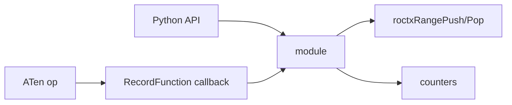
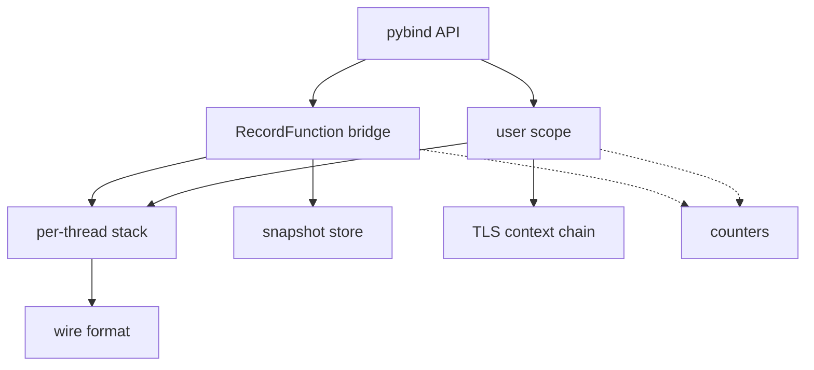
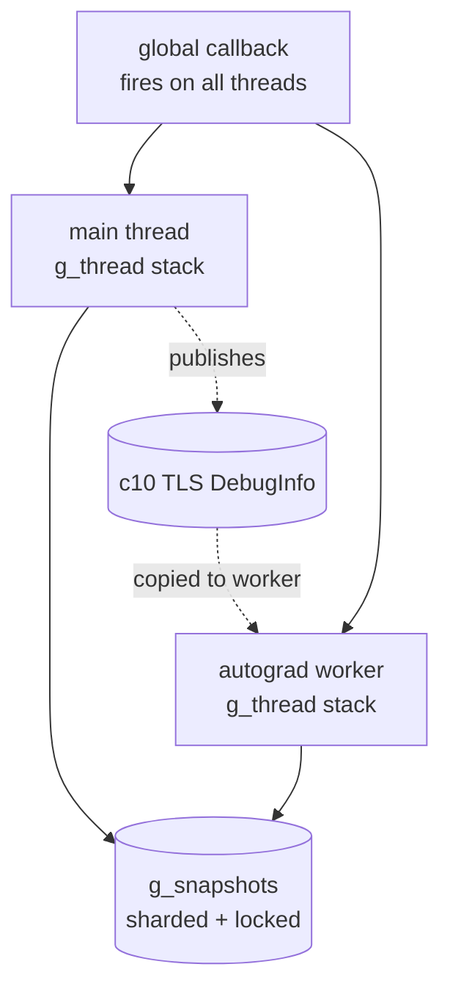
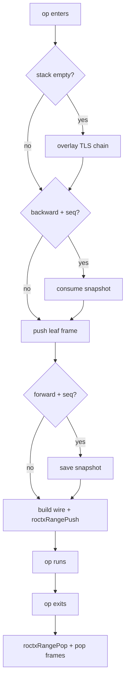
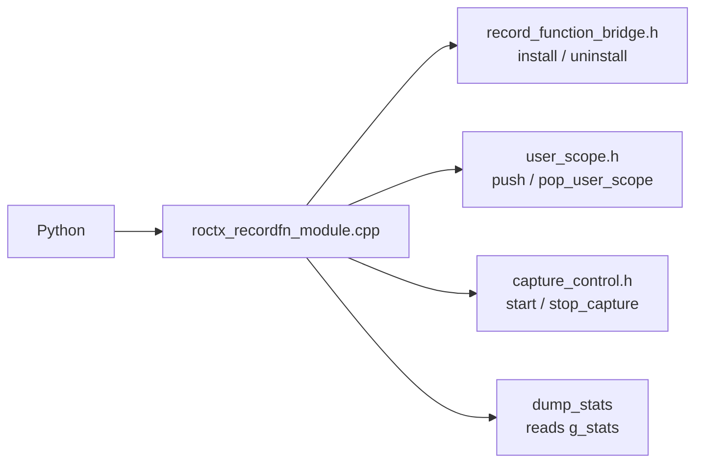
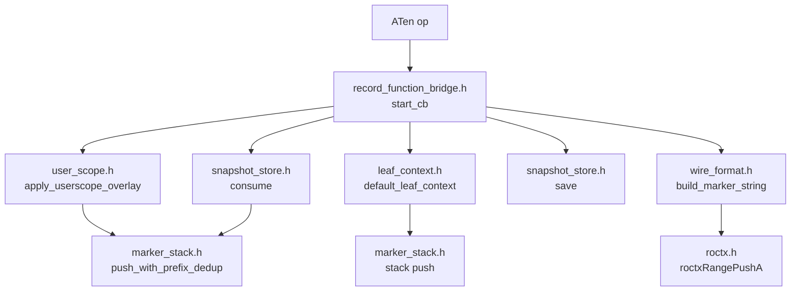
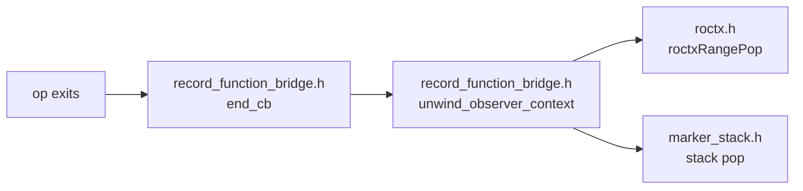
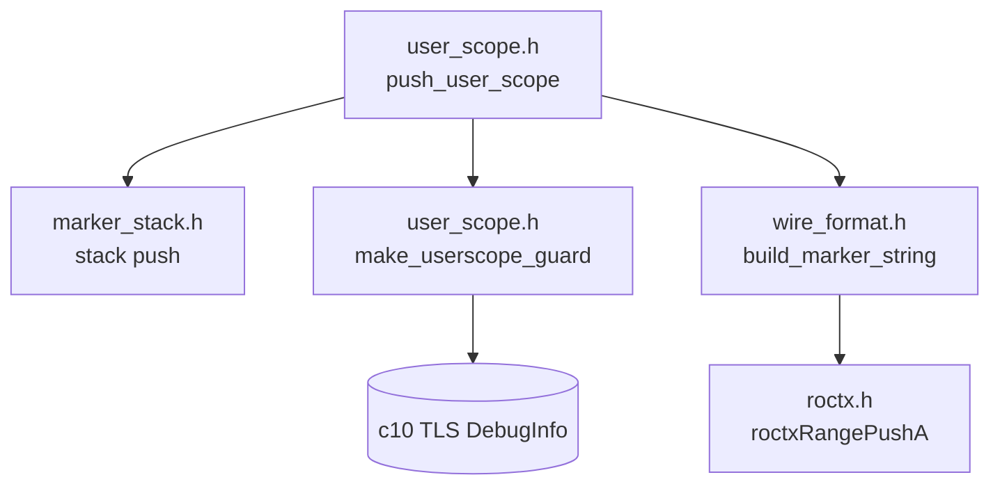
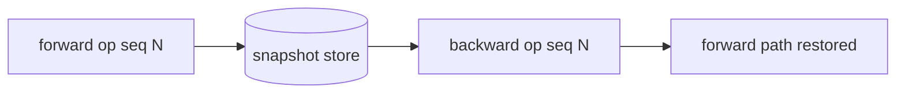
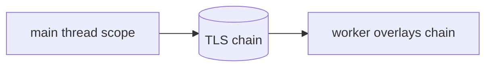

# roctx_recordfn: native RecordFunction tier

## Overview

`roctx_recordfn` is a C++ pybind11 extension. It registers a global PyTorch
`RecordFunction` callback that brackets every operator with a ROCTX range, and
exposes a small Python API for lifecycle control and structural markers. This
document specifies the module internals.



### Responsibilities

- Bracket every forward and backward operator, on every thread.
- Attribute a backward operator to the forward call that created it.
- Emit structural markers pushed from Python through the same stack.
- Keep the marker stack balanced and the workload alive on any callback error.

## Concepts and terminology

- **RecordFunction scope** — PyTorch brackets each operator with a scope. The
  module registers for `FUNCTION` (forward/eager ops) and `BACKWARD_FUNCTION`
  (autograd backward ops).
- **User scope** — a structural marker pushed from Python (`push_user_scope`)
  for a region the operator callback does not see, such as a training step or a
  module call.
- **Frame** (`StackEntry`) — one entry on the marker stack: a **marker** (the
  displayed name, e.g. `aten::mm`) and a **context** (`#<n>@<location>`, or a
  fixed leaf tag).
- **Leaf** — the frame the callback pushes for the current op. Its context is a
  fixed tag from `leaf_context.h` (aten top-level, aten nested, autograd
  backward, or autograd engine).
- **Sequence number** (`seqNr`) — PyTorch's per-op id that links a forward op to
  its backward op.
- **Wire string** — the encoded stack handed to ROCTX: `markers:contexts|backend`.

## Module layout

Stateful concerns are each a single global instance; the callback, user-scope,
and wire-format layers are stateless functions over them.



- **Per-thread stack** (`thread_local`) — the active marker frames.
- **Snapshot store** — sequence number to forward stack, for backward lookup.
- **TLS context chain** — publishes a thread's scope to autograd workers.
- **Wire format** — renders the stack into the pushed marker string.
- **Counters** — push/pop, snapshot, and error tallies for `dump_stats()`.

## Data structures

| Type (file) | Instance | Contents |
| --- | --- | --- |
| `StackEntry` (`stack_entry.h`) | — | one frame: marker name + context string |
| `ThreadState` (`marker_stack.h`) | `thread_local g_thread` | frame stack + debug-info guards owned by user scopes |
| `RoctxObserverContext` (`record_function_bridge.h`) | per op | flags for the range/leaf pushed and snapshot-frame count |
| `SnapshotStore` (`snapshot_store.h`) | `g_snapshots` | sharded map seqNr → stack; each shard has a map, an LRU list, and a mutex |
| `InstallState` (`install_state.h`) | `g_install` | callback handle, installed flag, mutex |
| `Stats` (`stats.h`) | `g_stats` | atomic counters |
| `CaptureBuffer` (`capture_buffer.h`) | `g_capture` | test-only buffer of emitted strings |

## Threading model



- The callback is **global**: one registration fires on every thread that runs
  ops. There is no per-thread install.
- The marker stack (`g_thread`) is **`thread_local`** — each thread owns its
  stack and guard vector, so stack access needs no locking.
- The **snapshot store** is process-wide and touched by many threads. It is
  sharded by `seqNr` with a per-shard mutex, so forward saves and backward
  consumes on different threads rarely contend.
- **Counters** are atomic; **install state** is mutex-guarded.
- Autograd runs backward on worker threads. PyTorch copies the parent's
  `ThreadLocalDebugInfo` to those workers, carrying the published user-scope
  chain so a worker can rebuild the parent context (see Cross-thread context).

## Stack maintenance

The stack is a `std::vector<StackEntry>` owned by the current thread. Because it
is thread-confined it takes no locks; correctness rests on balanced push/pop.

| Pushed by | Frames added | Popped by |
| --- | --- | --- |
| op entry (`start_cb`) | overlay (if stack empty) + consumed snapshot + one leaf | op exit (`end_cb`) |
| `push_user_scope` | one frame + one debug-info guard | `pop_user_scope` |

- `start_cb` records exactly what it pushed in the op's `RoctxObserverContext`
  (range flag, leaf flag, snapshot-frame count). `end_cb` reads that record and
  pops precisely those frames, so nested ops stay balanced no matter how many
  frames a given op added.
- User-scope frames also push a `DebugInfoGuard` onto a parallel `guards`
  vector; popping it un-publishes the chain.
- The overlay path uses `push_with_prefix_dedup`, so a chain already present as a
  leading prefix is not duplicated.

## Runtime flow

### End-to-end flow

One operator, from the callback firing to the emitted marker. The entry path
decides which frames to restore, then emits; the exit path unwinds exactly what
was pushed.



### Flow across files

The same op flow mapped onto the source files and their functions.

**Entry points** — Python calls land in the module file, which forwards to the
bridge, the user-scope helpers, and the capture/stats state.



**Operator entry** — `start_cb` restores context, pushes the leaf, then emits.



`start_cb` wraps the above in a `scope_guard.h` guard so any failure unwinds the
partial push; success stores what was pushed in the observer context.

**Operator exit** — `end_cb` unwinds exactly what `start_cb` recorded.



**User scope** — structural markers from Python take a parallel path that also
publishes the chain for autograd workers.



### Operator capture

The callback registers once for `FUNCTION` and `BACKWARD_FUNCTION` scopes. Each
op pushes a frame and a ROCTX range on entry, and pops both on exit. What was
pushed is stored in the observer context so exit unwinds exactly that.

```mermaid
sequenceDiagram
    participant Op as PyTorch op
    participant Start as start_cb
    participant End as end_cb
    Op->>Start: enter
    Start->>Start: push frame + range
    Start-->>Op: observer context
    Op->>End: exit
    End->>End: unwind observer context
```

`install()` is idempotent and guarded by a mutex; `uninstall()` removes the
callback. Both track a single handle.

## Forward-to-backward correlation

A forward op saves its stack keyed by its sequence number. The backward op
carries the same number and consumes the snapshot, rebuilding the forward path
before it emits.



The store is sharded (fixed shard count, per-shard mutex) so concurrent threads
rarely contend. Each shard has a soft cap and evicts its oldest entry (LRU),
which bounds memory when backward never runs (for example detached forward).

## Cross-thread context

Autograd runs on worker threads that do not inherit the main thread's stack. A
`push_user_scope` publishes the current chain into thread-local debug info,
which PyTorch copies to the workers. Whenever a thread's stack is empty at op
entry (every top-level op on a worker, since it drains after each op), the
callback overlays that chain; a matching leading prefix is skipped so it is not
duplicated.



The debug-info slot is a private string-keyed slot when the PyTorch build
supports it, otherwise a built-in slot detected at build time.

## Wire format

A stack renders as `markers:contexts|backend`, frames joined by `/`. `%` and `/`
within a marker name are percent-encoded (`%25`, `%2F`) so a name cannot be
misread as a separator; contexts are not encoded. The analysis decoder reverses
this, verified by a round-trip test.

## Error and lifetime safety

- Each operator callback runs in a single `try/catch(...)`; a caught error is
  counted in `g_stats.callback_errors` and does not propagate.
- A partial push in `start_cb` unwinds through a scope guard, so a mid-push
  failure leaves the stack balanced. `push_user_scope` counts the error and
  re-raises to Python; `pop_user_scope` counts and returns.
- Header-defined globals are `inline` so the static core library, the pybind
  module, and the test binary share one instance of each.

## Python API

| Function | Purpose |
| --- | --- |
| `install` / `uninstall` / `is_installed` | Manage the global callback |
| `push_user_scope` / `pop_user_scope` | Emit a structural marker frame |
| `dump_stats` | Return counters for debugging |
| `start_capture` / `stop_capture` | Record emitted strings for tests |

## Build and packaging

- A static core library carries the shared source and its usage requirements
  (torch/roctx includes and libraries, debug-info flag); the pybind11 `MODULE`
  and the gtest binary both link it. The module omits the `lib` prefix and is
  named by tag so the loader resolves it.
- A probe script reports the interpreter's Python/torch paths and a source
  fingerprint; these form the tag and resolve includes and torch libraries by
  absolute path.
- A compile check selects the debug-info slot.
- One `CMakeLists` serves two modes: a subdirectory build under the project test
  target, and a standalone build the runtime loader invokes when no prebuilt
  module matches the tag.

## Validation

- **gtest** — snapshot store (save/consume, one-shot, LRU eviction, per-shard,
  concurrency), wire encoding round-trip, leaf labels, install/uninstall, scope
  balance, and real forward/backward runs on GPU.
- **Counters** — `dump_stats()` surfaces push/pop balance, snapshot hit rate,
  and callback errors.

## Limitations

- On newer PyTorch/ROCm the Inductor static launcher runs Triton kernels below
  the RecordFunction layer, so those kernels attribute to the enclosing torch
  scope rather than a distinct Triton operator.
- The built-in debug-info slot used on older builds is shared with any other
  debug-info user in the process.
